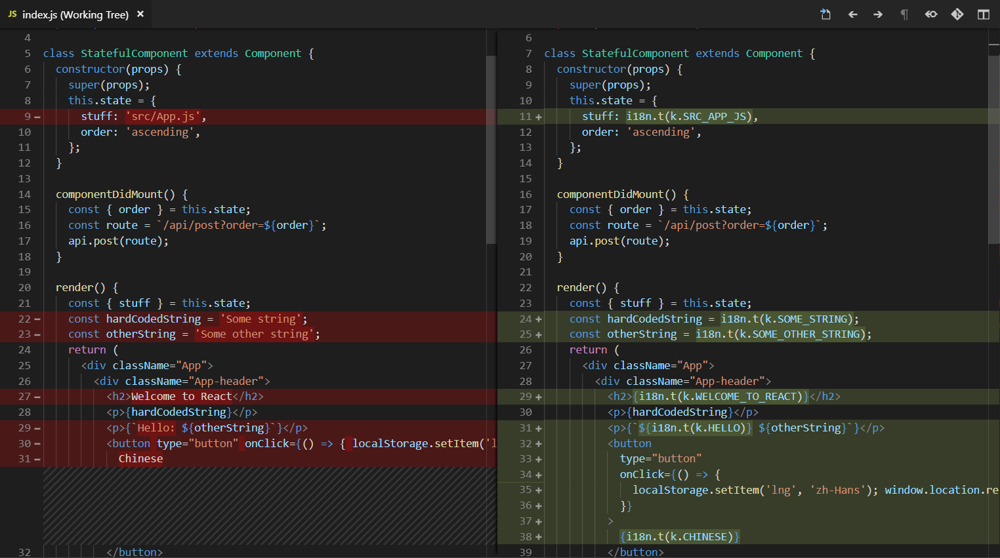

# i18nize-react

Internationalize legacy react apps in a lunch break.

`i18nize-react` finds and replaces all the hardcoded string literals in your react project with i18n bindings. It uses `babel` to walk on react components and process them.



## Getting started

1. First install the `i18nize-react` globally using npm

```sh
npm i -g i18nize-react
```

2. Now in your react app run

```sh
npm install i18next
```
Tested on `i18next` other variants should work with minor changes.

Make sure there are no unstaged changes, you may need to `git reset --hard`.

3. Now run.
```sh
i18nize-react
```

4. Go for lunch

5. Run your favourite linter to clean things up.

6. It should create four files `src/i18n/init.js`, `src/i18n/keys.js`, `src/i18n/english.js`, `src/i18n/chinese.js`. Add the line `import ./i18n/init.js;` in your App's entry point. Usually it is `src/index.js`.

7. Change the `lng` key in your browser's local storage to see changes.

## Contributions

Create an issue ticket with a before and after code snippets, before writing any code and raising a PR.

For bugs create a minimum reproducible piece of code with original, received and expected snippets.

## Troubleshooting

1. Sometimes `i18ize-react` might conflict with the babel plugins installed in your project. If that happens go up one folder (`cd ..`) and then run `i18ize-react ./your-dir ./your-dir`

2. By default `i18ize-react` assumes that your code is in `<your workspace dir>/src` but if you want to change that you can use the third argument. e.g. `i18ize-react ./ ./ web` will crawl  `<your workspace dir>/web` instead.

3. Constant initialization outside react lifecycle is not guaranteed. To resolve this, move all initialized strings inside the component.

```js
// String 1 might not load correctly 
const string1 = i18next.t(k.STRING1);
const MyComponent = () => {
  // String 2 will load correctly
  const string2 = i18next.t(k.STRING2);

  return (
    <div>
      {string1}
      {string2}
    </div>
  )
}
```

4. **TIP:** Babel's parse and generate often shifts code around which causes files, with no programatic change, to show up in git diff. Sometimes running the linter alone does not fix this problem. A good way to fix this problem is to do a dry run `i18nize-react ./ ./ src true`, run your linter and commit the code. Now run `i18nize-react` to run the transform and lint again. Now only the transformed changes should show up in git diff.
